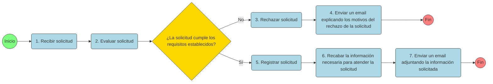

# legaltech-pset-solicitud

## 📊 Dataset: legaltech_pset_solicitudes.xlsx

Este conjunto de datos simula el funcionamiento de un proceso administrativo digitalizado, usado como base para ejercicios del curso **LegalTech**.  
Contiene tres tablas relacionadas que describen a los solicitantes, las solicitudes recibidas y el trámite posterior de aquellas que fueron aprobadas.

---

### 🧍 Tabla 1: Solicitantes

| Variable | Tipo de dato | Descripción |
|-----------|---------------|--------------|
| `codigo_solicitante` | Texto (string) | Identificador único del solicitante. |
| `nombre` | Texto (string) | Nombres del solicitante. |
| `apellido` | Texto (string) | Apellidos del solicitante. |
| `sexo` | Texto (string) | Sexo declarado: masculino, femenino o no_indico. |
| `fecha_nacimiento` | Fecha (date) | Fecha de nacimiento del solicitante. |
| `nivel_de_estudios` | Texto (string) | Nivel máximo de estudios alcanzado. |
| `ocupacion` | Texto (string) | Ocupación principal del solicitante. |

---

### 📄 Tabla 2: SolicitudesRecibidas

| Variable | Tipo de dato | Descripción |
|-----------|---------------|--------------|
| `codigo_solicitud` | Texto (string) | Identificador único de la solicitud. |
| `codigo_solicitante` | Texto (string) | Código del solicitante que presenta la solicitud. |
| `fecha_presentacion` | Fecha-hora (datetime) | Fecha y hora de presentación de la solicitud. |
| `estado` | Texto (string) | Estado del trámite: evaluado o pendiente. |
| `fecha_evaluacion` | Fecha-hora (datetime o vacío) | Fecha y hora en que la solicitud fue evaluada. |
| `resultado_evaluacion` | Texto (string o vacío) | Resultado de la evaluación: sí_cumple o no_cumple. |

---

## ⚙️ Tabla 3: TramiteSolicitudes

| Variable | Tipo de dato | Descripción |
|-----------|---------------|--------------|
| `codigo_solicitud` | Texto (string) | Identificador único de la solicitud (referencia a SolicitudesRecibidas). |
| `estado_registro` | Texto (string) | Estado del registro: registrado o pendiente. |
| `fecha_registro` | Fecha-hora (datetime o vacío) | Fecha y hora del registro. |
| `estado_informacion` | Texto (string o vacío) | Estado de la información: recibida o pendiente. |
| `fecha_informacion` | Fecha-hora (datetime o vacío) | Fecha y hora en que se recibió la información. |
| `estado_email` | Texto (string o vacío) | Estado del correo: enviado o pendiente. |
| `fecha_email` | Fecha-hora (datetime o vacío) | Fecha y hora de envío del correo. |

---

### 📁 Detalles técnicos

- **Formato del archivo:** Excel (.xlsx)  
- **Hojas:** `Solicitantes`, `SolicitudesRecibidas`, `TramiteSolicitudes`  
- **Codificación:** UTF-8  
- **Zona horaria de fechas:** `America/Lima (GMT-5)`  
- **Reproducibilidad:** SEED = 42  

---

## 💡 Uso sugerido

Ideal para prácticas de:
- Análisis de procesos administrativos y trazabilidad.
- Modelado de datos y construcción de dashboards.
- Simulación de flujos LegalTech o automatización con IA.