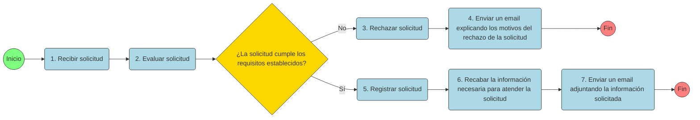

# legaltech-pset-solicitud

```mermaid
flowchart LR
    %% Definición de nodos
    A((Inicio)):::inicio --> B(1. Recibir solicitud):::tarea --> C(2. Evaluar solicitud):::tarea --> D{¿La solicitud cumple los requisitos establecidos?}:::decision

    D -- No --> E(3. Rechazar solicitud):::tarea --> F(4. Enviar un email explicando los motivos del rechazo de la solicitud):::tarea --> G((Fin)):::fin

    D -- Sí --> H(5. Registrar solicitud):::tarea --> I(6. Recabar la información necesaria para atender la solicitud):::tarea --> J(7. Enviar un email adjuntando la información solicitada):::tarea --> K((Fin)):::fin

    %% Estilos
    classDef inicio fill:#7FFF7F,stroke:#333,stroke-width:1px,color:#000;       %% Verde
    classDef fin fill:#FF7F7F,stroke:#333,stroke-width:1px,color:#000;          %% Rojo
    classDef decision fill:#FFD700,stroke:#333,stroke-width:1px,color:#000;     %% Amarillo
    classDef tarea fill:#ADD8E6,stroke:#333,stroke-width:1px,color:#000;        %% Azul claro
```
