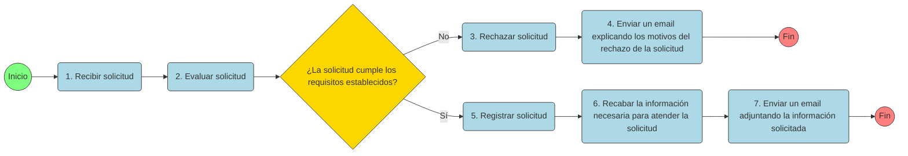

# PSET - Legal Tech

## Situación inicial

La Municipalidad de Ideas Creativas ha decidido modernizar sus procesos administrativos para reducir tiempos de espera, corrupción latente y opacidad en la gestión. Recientemente, el alcalde electo, motivado por un escándalo mediático de solicitudes perdidas y ciudadanos burlados, ha aprobado la creación de una Unidad Especial LegalTech con abogados, tecnólogos y analistas de datos.

Usted (y su equipo) ha sido convocado como parte de esa unidad. Su misión: diagnosticar el proceso de atención de solicitudes administrativas de la Municipalidad (por ejemplo, peticiones ciudadanas, permisos, derechos de acceso a información). Se les ha entregado un dataset que simula los registros reales: quién hizo cada solicitud, cuándo fue recibida, su tipo, el trámite que tuvo, si fue rechazada o aprobada, plazos, tiempos internos, etc.

Desde el primer día ustedes sienten el peso: la burocracia tiene rutas ocultas, múltiples rechazos inexplicables, “tiempos muertos” en los expedientes, faltas de trazabilidad y poco control interno. Se rumorea que algunos funcionarios postergaban tareas para seguir cobrando “gestión informal”.

Su tarea como equipo: atravesar el historial de solicitudes, reconstruir y entender la cadena de procesos (recibir, evaluar, solicitar información adicional, resolver, notificar), detectar cuellos de botella, medir indicadores de rendimiento, descubrir posibles anomalías e ineficiencias, y proponer mejoras. 

## Proceso identificado

Como parte del trabajo inicial, y luego de escuchar al personal de la Municipalidad, su eequipo ha levantado el siguiente flujo:

1. **Recibir solicitud:** El ciudadano remite su petición mediante el canal oficial (plataforma web municipal, buzón digital o formato físico que luego se digitaliza). En esta fase se registra la solicitud con campos esenciales: nombre del solicitante, fecha de recepción, tipo de petición y asunto.

2. **Evaluar solicitud:** Un funcionario revisa la solicitud recibida para verificar si cumple con los requisitos formales exigidos: datos completos, documentos adjuntos, cumplimiento de normas básicas, plazos correctos, etc.

3. **Rechazar solicitud:** Si la solicitud no cumple los requisitos, se ejecuta esta tarea de rechazo formal: se determina que la petición no puede continuar por incumplimientos detectados en la etapa de evaluación.

4. **Enviar un email explicando los motivos del rechazo de la solicitud:** Tras la decisión de rechazo, se genera una comunicación al solicitante (vía correo electrónico u otro medio establecido) explicando claramente los motivos por los cuales fue rechazada la solicitud, con referencias normativas o requisitos faltantes.

5. **Registrar solicitud:** Si la solicitud supera la evaluación (cumple requisitos), en esta tarea se formaliza su registro en el sistema de trámites internos. Se asigna un número de expediente, responsable, fecha de inicio y estado inicial del trámite.

6. **Recabar la información necesaria para atender la solicitud:** En esta etapa se solicita al interesado (o se recolectan internamente) los documentos, datos o evidencias complementarias necesarias para sustentar la solicitud. El expediente queda abierto mientras se obtenga la información.

7. **Enviar un email adjuntando la información solicitada:** Una vez completada la información requerida, se genera una respuesta al ciudadano mediante correo (o el medio oficial), adjuntando la información solicitada o el resultado de la atención. Con esto, el proceso concluye para ese expediente.

## 📊 Dataset: legaltech_pset_solicitudes.xlsx

Para facilitar el análisis de la información, se ha construido un dataset con la información de los sistemas de la Municipalidad. A continuación se describe las tablas que lo componen:

---

### 🧍 Tabla 1: Solicitantes

| Variable | Tipo de dato | Descripción |
|-----------|---------------|--------------|
| `codigo_solicitante` | Texto (string) | Identificador único del solicitante. |
| `nombre` | Texto (string) | Nombres del solicitante. |
| `apellido` | Texto (string) | Apellidos del solicitante. |
| `sexo` | Texto (string) | Sexo declarado: masculino, femenino o no_indico. |
| `fecha_nacimiento` | Fecha (date) | Fecha de nacimiento del solicitante. |
| `nivel_de_estudios` | Texto (string) | Nivel máximo de estudios alcanzado. |
| `ocupacion` | Texto (string) | Ocupación principal del solicitante. |

---

### 📄 Tabla 2: SolicitudesRecibidas

| Variable | Tipo de dato | Descripción |
|-----------|---------------|--------------|
| `codigo_solicitud` | Texto (string) | Identificador único de la solicitud. |
| `codigo_solicitante` | Texto (string) | Código del solicitante que presenta la solicitud. |
| `fecha_presentacion` | Fecha-hora (datetime) | Fecha y hora de presentación de la solicitud. |
| `estado` | Texto (string) | Estado del trámite: evaluado o pendiente. |
| `fecha_evaluacion` | Fecha-hora (datetime o vacío) | Fecha y hora en que la solicitud fue evaluada. |
| `resultado_evaluacion` | Texto (string o vacío) | Resultado de la evaluación: sí_cumple o no_cumple. |

---

## ⚙️ Tabla 3: TramiteSolicitudes

| Variable | Tipo de dato | Descripción |
|-----------|---------------|--------------|
| `codigo_solicitud` | Texto (string) | Identificador único de la solicitud (referencia a SolicitudesRecibidas). |
| `estado_registro` | Texto (string) | Estado del registro: registrado o pendiente. |
| `fecha_registro` | Fecha-hora (datetime o vacío) | Fecha y hora del registro. |
| `estado_informacion` | Texto (string o vacío) | Estado de la información: recibida o pendiente. |
| `fecha_informacion` | Fecha-hora (datetime o vacío) | Fecha y hora en que se recibió la información. |
| `estado_email` | Texto (string o vacío) | Estado del correo: enviado o pendiente. |
| `fecha_email` | Fecha-hora (datetime o vacío) | Fecha y hora de envío del correo. |

---

